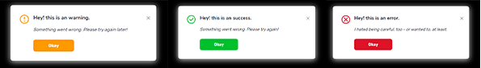

# reactjs-alert

    

### Support

For managing this package I need your support, thank you... <br /><br />
<a href="https://www.buymeacoffee.com/duttasourav" target="_blank"></a>

## Installation

A simple reactjs alert component.
To get started, try installing the reactjs-alert:

- `npm install --save reactjs-alert` or
- `npm i reactjs-alert`

## Working Demo with example code

<!-- https://t1ur0h.csb.app/ -->

[](https://t1ur0h.csb.app/)

[](https://codesandbox.io/s/awesome-dirac-t1ur0h?file=/src/App.js)

## Example screenshot



## How to use

An unique idea of displaying alerts in pop up with 'reactjs-alert' for different types (i.e. success, warning, error, info). Use type, status, text as props in your code and that's all. You can configure the reactjs-alert with it's avilable props, see documentation for a detailed knowledge.

To add this npm to your project run:

- `npm install --save reactjs-alert` or
- `npm i reactjs-alert`

Import it to your specific project file:

```js
import ReactJsAlert from "reactjs-alert"
...
```

Finally, add the `ReactJsAlert` component in your code:

### Class Component

```js

<ReactJsAlert
    status={true}   // true or false
    type="success"   // success, warning, error, info
    title="Hey! this is an alert."   // title you want to display
    Close={() => this.setState({ status: false })}   // callback method for hide
/>

...
```

### Functional Component

```js

const [status, setStatus] = useState(false);
const [type, setType] = useState("success");
const [title, setTitle] = useState("This is a alert");

<ReactJsAlert
  status={status} // true or false
  type={type} // success, warning, error, info
  title={title}
  Close={() => setStatus(false)}
/>

...
```

This import of ReactJsAlert hook is able to show alerts.
And that's it!

## Available props

```js

status: true or false *
title: string  ( an alert title ) *
type: string   ( value : success, warning, error, info ) *
color: string  ( hex code [i.e. #f4f4f4] ) (OPTIONAL)
quotes: true or false ( required if you want a quote )
quote: string  ( a brief message on alert ) (OPTIONAL)
button: string ( text you want to display in button i.e. 'Try Again' )
autoCloseIn : number (a time after that pop up will be closed i.e. 3000 )
```

**Use a call back method (arrow function) to close it manually**

```js

Close: callBackMethod()

( i.e. < Close={() => this.setState({ status: false })} >)

( i.e. < Close={() => setStatus(false)} >)

```

## Peer dependencies

This package expect the following peer dependencies:

```js

"peerDependencies": {
    "react": "^16.13.1",
    "react-dom": "^16.13.1"
},

```

So make sure that you have those installed too!

## Example usage

An example of showing alerts simultaneously:

### Class Component

```js
import React, { Component } from "react";
import ReactJsAlert from "reactjs-alert";

export default class App extends Component {
  constructor(props) {
    super(props);

    this.state = {
      type: "error",
      status: true,
      title: "Hey! this is an error.",
    };
  }

  render() {
    return (
      <div className="App">
        <ReactJsAlert
          status={this.state.status} // true or false
          type={this.state.type} // success, warning, error, info
          title={this.state.title}
          Close={() => this.setState({ status: false })}
        />
      </div>
    );
  }
}
```

### Functional Component

```js
import React, { useState } from "react";
import ReactJsAlert from "reactjs-alert";

export default function App() {
  const [status, setStatus] = useState(false);
  const [type, setType] = useState("");
  const [title, setTitle] = useState("");

  return (
    <div className="App">
      <button
        onClick={() => {
          setStatus(true);
          setType("success");
          setTitle("This is a success alert");
        }}
      >
        Success Alert
      </button>

      <ReactJsAlert
        status={status} // true or false
        type={type} // success, warning, error, info
        title={title}
        quotes={true}
        quote="This is a dummy design that shows an example of reactjs-alert"
        Close={() => setStatus(false)}
      />
    </div>
  );
}
```

Make sure to follow me on github for latest update! Thanks...

**This component is built as a package to npm by Sourav Dutta.**

### Happy Coding ♡

<a href="https://www.buymeacoffee.com/duttasourav" target="_blank"></a>
